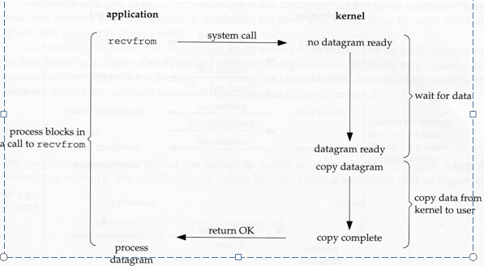
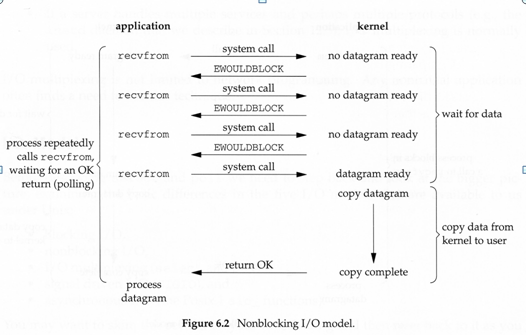
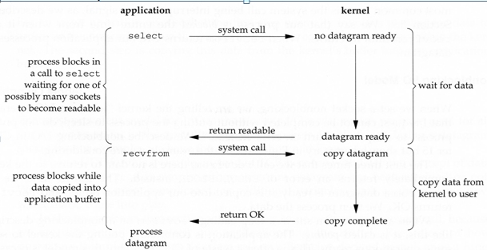
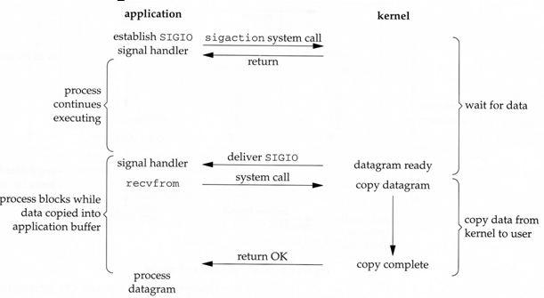
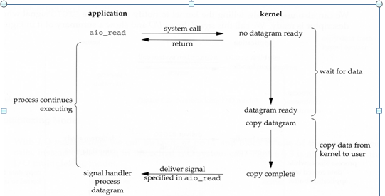
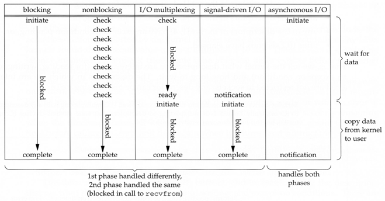

= IO Models
:toc: macro
:sectnumlevels: 4

La idea de este documento es revisar los distintos modelos de IO.

toc::[]
== Why?

Antes de empezar a entender los distintos modelos de IO, seria bueno saber por que
podríamos estar interesado en ellos.

Cuando desarrollamos una aplicación, esta realiza distintas tareas, realizar cálculos,
leer archivos, enviar emails, etc. Dependiendo del tipo de tarea que ejecutemos podremos
decir que nuestro proceso es *CPU-bound* o *I/O-bound*.

=== CPU-bound vs I/O-bound

Se dice que nuestro proceso es CPU-bound si el bottlenecked es el CPU o IO-bound
si el bottlenecked son las operaciones de IO, como leer o escribir archivos o operaciones
de networking.

Cuando nos encontramos desarrollando aplicaciones IO-bound nos resulta util conocer y entender
los distintos modelos de IO. Por ejemplo podríamos analizar el caso de cualquier
servidor de alta performance (Netty, Grizzly, etc).

== IO

Si pensamos en algún servidor web, veremos que la parte de IO resulta fundamental a la hora
de manejar multiples requests. Estamos leyendo request data por medio de la red, enviando el
response para esa request e incluso leyendo archivos desde disco para servir contenido estático.

*Es util pensar a las operaciones de IO en dos etapas*

* No hay datos o están en el controller -> Los *_datos están disponibles_* para el kernel.
* Datos en los buffers del kernel -> Datos en la memoria de la aplicación.

*La primera etapa de chequeo del dispositivo puede ser blocking o non-blocking, y la segunda de transmicion de
los datos puede ser synchronous o asynchronous.*

Otra aclaración importante es que significa que los *_datos están disponibles_* y esto va
a depender de la información que estemos leyendo.

* UDP: Un datagrama entero fue recibido.
* TCP: Datos recibidos que desde la ultima watermark.

=== User mode vs Kernel mode

Un proceso ejecuta instrucciones en dos modos distintos, ya sea a nivel de aplicación o a nivel de kernel, ya
que ciertas acciones necesitan mas privilegios que otras. Esto para el usuario es transparente pero hacer el switch
de un modo al otro es costo.

* *Kernel mode:* El código que se esta ejecutando tiene acceso completo e ilimitado al hardware subyacente.
Este puede ejecutar cualquier instrucción y referenciar cualquier dirección de memoria. Este modo es reservado
funciones de bajo nivel del sistema operativo. Cualquier crash en este nivel seria catastrófico y detendría la PC.

* *User Mode:* El código que se esta ejecutando no tiene la capacidad de acceder a hardware o memoria sin delegar estas
acciones en una llamado a un API del sistema (system call). Debido a esta separación los crash a este nivel son
recuperables, la mayoría del código se ejecuta en este nivel.

image::images/ProtectionRings.png[]

== Models

Iremos explicando cada modelo junto con una imagen y las descripción de lo que sucede.

_Nota: Las imágenes son de un ejemplo de socket UDP ya que el concepto de data being "ready" es mas simple_

=== 1. Blocking I/O

El modelo más frecuente de IO es el blocking IO, este es el utilizado por las clases del paquete java.io.
Además todos los sockets son blocking por defecto.

En la imagen se ve que el proceso llama a _recvfrom_ y la system call no retorna hasta que el datagrama llega y es
copiado al buffer de la aplicación o ocurre un error.
Decimos que nuestro proceso esta _blocked_ durante todo el tiempo hasta que la system call retorna.

=== 2. Non Blocking IO

Cuando realizamos una operación de IO, esta se encuentra asociada a un FD (File Descriptor) el cual podemos configurar
para ser Non-Blocking, de esta forma le estamos indicando al kernel que _"Cuando una operación de IO no pueda ser completada arroje un error
en lugar de pasar al proceso al estado de sleep"_

* Para los tres primeros llamados a _recvfrom_ no hay datos y el kernel retorna de forma inmediata con el error _EWOULDBLOCK_.
* Para el cuarto llamado, el datagrama esta listo y es copiado en el buffer de la aplicación, ahora _recvfrom_ retorna de forma exitosa. Luego los datos son procesados.

Cuando una aplicación se encuentra en un loop invocando alguna operación nonblocking sin obtener datos, esto se lo conoce como pooling (busy waiting).
La aplicación esta continuamente haciendo polling para ver si el kernel le indica que hay datos listos. Esto generalmente es un desperdicio de CPU, aunque puede ser
util en algunos escenarios específicos.

=== 3. I/O MULTIPLEXING (select/poll/epoll/kqueue)

==== What is I/O multiplexing?

Es la capacidad para indicarle al kernel que queremos ser notificados si uno o mas operaciones de IO están listas.
Algunas funciones como select, poll, epoll (linux) and kqueue (bsd) nos proveen esta funcionalidad.

==== Why Multiplexing?

Cuando una aplicación necesita manejar multiples descriptores de IO al mismo tiempo. e.g. file y socket descriptors o multiples socket descriptors.

==== I/O MULTIPLEXING

Cuando usamos IO Multiplexing podemos utilizar alguna de las funciones provistas por el kernel (select, poll, epoll, kqueue) y hacer el block
en una de esas operaciones, en lugar de la system call de IO. +
En lugar de trabajar sobre un único file descriptor, podemos monitorear cambios en varios de ellos.

En el ejemplo de arriba hacemos el block en el llamado al _select_, esperando a que el datagrama esta listo para ser leído.
Cuando el _select_ retorna esto indica que el socket es "readable", entonces podemos llamar a _recvfrom_ para copiar el datagrama
en el buffer de nuestra aplicación.

===== Comparing to the blocking I/O model
Si comparamos la figura del modelo 1 y la del 3:

* Ventajas: Podemos monitorear mas de un descriptor hasta que este listo
* Desventajas: Usando el _select_ requiere dos system calls _(select y recvfrom)_ en lugar de un solo llamado.

===== Multithreading with blocking I/O

Otro modelo muy relacionado es el de _Multithreading con blocking IO_. Ese modelo se asemeja mucho al anterior, excepto que en lugar de usar
_select_ para bloquear multiples descriptores utiliza multiples hilos, o sea uno por descriptor.

=== 4. Signal-Driven I/O Model (SIGIO)

Tambien podemos decirle al kernel que nos notifique por medio de la señal _SIGIO_ cuando el descriptor esta listo.

* Primero instruimos al socket para enviar señales e instalamos un _signal handler_ por medio de la system call _sigaction_.
El retorno de este system call es inmediato y nuestro proceso continua; esto no es bloqueante.

* Cuando el datagrama esta listo, la señal _SIGIO_ es generada para nuestro proceso. Podemos:

** Leer el datagrama desde el _signal handler_ llamando a _recvfrom_ y luego notificar al loop principal que los datos estan listo en el buffer de la aplicación.

** Notificar al loop principal y dejar que este lea el datagrama.

Sin importar como manejamos la señal, la ventaja de este modelo es que no estamos bloqueados mientras esperamos que el datagrama este llegue. El loop
principal puede continuar ejecutando y solo esperar a ser notificado por el _signal handler_ que hay mas datos para ser procesados o leídos.

=== 5. Asynchronous I/O (AIO)

== Comparison of the I/O Models

